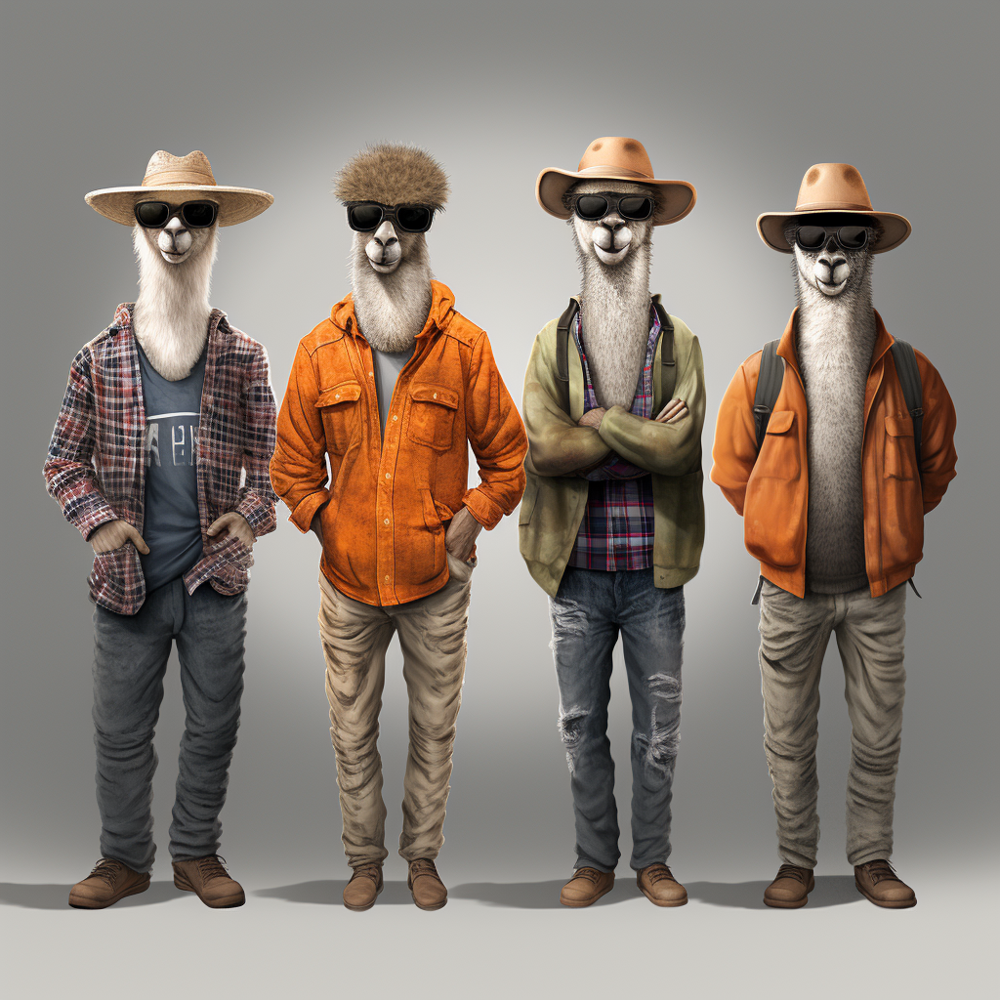

# Multi-LoRAs

> Load multiple LoRA modules simultaneously and automatically switch the appropriate combination of LoRA modules to generate the best answer based on user queries.



Multi-LoRAs is a LLM toolkit that can simultaneously load multiple LoRA modules and automatically switch to the appropriate combination of LoRA modules based on user queries to generate the best answer. It includes tools such as extracting LoRA modules from efficiently parameters fine-tuning models, merging base models with LoRA models, and routing multiple LoRA models.

Tools:

- Extract the LoRA module from a model that has undergone efficient parameter fine-tuning.
- Tool for merging LoRA module into the base model.
- Multi LoRAs router (Under development)

## Experiments

### Mixture-of-Multi-LoRAs

DARE (Drop and REscale) was proposed in the paper [Language Models are Super Mario: Absorbing Abilities from Homologous Models as a Free Lunch](http://arxiv.org/abs/2311.03099). The insight is that most delta parameters can be directly set to zero without affecting the capabilities of SFT LMs. Based on this, we can use the DARE algorithm to fine-tune multiple efficient parameterized models with different capabilities by sparsifying delta parameters, and further obtain a more powerful new model that maintains the strengths of each submodel through model merging algorithms.

The following experiment will select multiple models with strong overall performance and outstanding sub-indicators on the [Open LLM Leaderboard](https://huggingface.co/spaces/HuggingFaceH4/open_llm_leaderboard). Each model will be built into its own DARE model, and the existing extract-lora function of multi-loras will be used to extract the LoRA module of each DARE model. It is hoped to ultimately build a new powerful model composed of multiple professional LoRA modules. We will name this Mixture-of-Multi-LoRAs.

Source LLM：mistral/Mistral-7B-v0.1

DARE: weight_mask_rate=0.85 / use_weight_rescale=True / mask_stratery=random / scaling_coefficient=1.0

PEFT Models:

- Intel/neural-chat-7b-v3-1 [DARE Model](https://huggingface.co/uukuguy/neural-chat-7b-v3-1-dare-0.85)
- bhenrym14/mistral-7b-platypus-fp16 [DARE Model](https://huggingface.co/uukuguy/mistral-7b-platypus-fp16-dare-0.9)
- jondurbin/airoboros-m-7b-3.1.2 [DARE Model](https://huggingface.co/uukuguy/airoboros-m-7b-3.1.2-dare-0.85)
- migtissera/SynthIA-7B-v1.3 [DARE Model](https://huggingface.co/uukuguy/SynthIA-7B-v1.3-dare-0.85)
- uukuguy/speechless-code-mistral-orca-7b-v1.0
- teknium/CollectiveCognition-v1.1-Mistral-7B
- ehartford/dolphin-2.2.1-mistral-7b
- uukuguy/speechless-mistral-dolphin-orca-platypus-samantha-7b [DARE Model](https://huggingface.co/uukuguy/speechless-mistral-dolphin-orca-platypus-samantha-7b-dare-0.85)
- HuggingFaceH4/zephyr-7b-alpha

### Mistral-7B-OpenOrca

- Extract lora model [Mistral-7B-OpenOrca-lora](https://huggingface.co/uukuguy/Mistral-7B-OpenOrca-lora) from [Mistral-7B-OpenOrca](https://huggingface.co/Open-Orca/Mistral-7B-OpenOrca);

- Merge the base model [Mistral-7B-v0.1](https://huggingface.co/mistralai/Mistral-7B-v0.1) with lora model to [Mistral-7B-OpenOrca-lora-merged](https://huggingface.co/uukuguy/Mistral-7B-OpenOrca-lora-merged)

- LLM Evaluation ...

#### Local Test

| | ARC_acc_norm (25-shot) | HellaSwag_acc_norm (10-shot) | MMLU_acc (5-shot) | TruthfulQA_mc2 (0-shot) | GSM8K_acc (8-shot) | Open LLM Score |
| ------ | ------ | ------ | ------ | ------ | ------ | ------ |
| Mistral-7B-OpenOrca | **71** | 83 | 61.42 | 45 | 40 | 65.11 |
| r=256 | 68 | 84 | 64.28 | 46.953 | **41** |  65.81 |
| **r=128** | 68 | **84** | **64.368** | 47.239 | **41** |  **65.90** |
| r=64 | 67 | 84 | 64.26 | **47.32** | **41** | 65.65 |
| *r=16* | *65* | *83* | *62.84* | *46.95* | *38* | *64.45* |

#### Open LLM Leaderboard

| | ARC_acc_norm (25-shot) | HellaSwag_acc_norm (10-shot) | MMLU_acc (5-shot) | TruthfulQA_mc2 (0-shot) | Open LLM Score |
| ------ | ------ | ------ | ------ | ------ | ------ |
| Mistral-7B-SlimOrca | 62.54 | 83.86 | **62.77** | **54.23** |  **65.85** |
| Mistral-7B-OpenOrca | **64.08** | **83.99** | 62.24 | 53.05 |  65.84 |

## Install

```bash
pip install multi-loras
# - or -
pip install git+https://github.com/uukuguy/multi_loras.git
```

## Quick Start

Extract LoRA model from a model.

```bash
python -m multi_loras \
    extract_lora \
    --base_model_name_or_path ${BASE_MODEL_PATH} \
    --tuned_model_name_or_path ${TUNED_MODEL_PATH} \
    --save_path ${LORA_SAVE_PATH} \
    --bf16 \
    --bits 4 \
    --lora_r 128
```

Merge the extracted LoRA model with the base model.

```bash
python -m multi_loras \
    merge_lora \
    --base_model_name_or_path ${BASE_MODEL_PATH} \
    --lora_model_path ${LORA_SAVE_PATH} \
    --merged_model_name_or_path ${TASK_MODEL_PATH}
```

## References

- Gradio GUI for Kohya’s Stable Diffusion Trainer

[bmaltais/kohya_ss](https://github.com/bmaltais/kohya_ss)
> networks/extract_lora_from_models.py
> networks/merge_lora.py
> networks/resize_lora.py
> network/lora.py
> network/lora_fa.py
> network/dylora.py

- LoRA for Text-to-Image

[cloneofsimo/lora](https://github.com/cloneofsimo/lora)
> lora_diffusion/cli_svd.py

- Microsoft LoRA
[LoRA](https://github.com/microsoft/LoRA)
